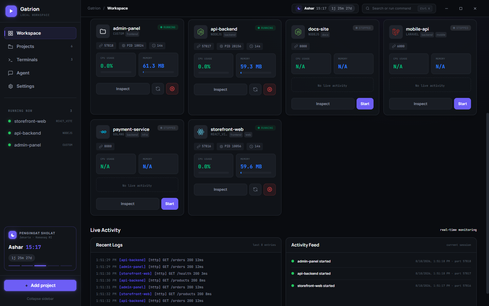
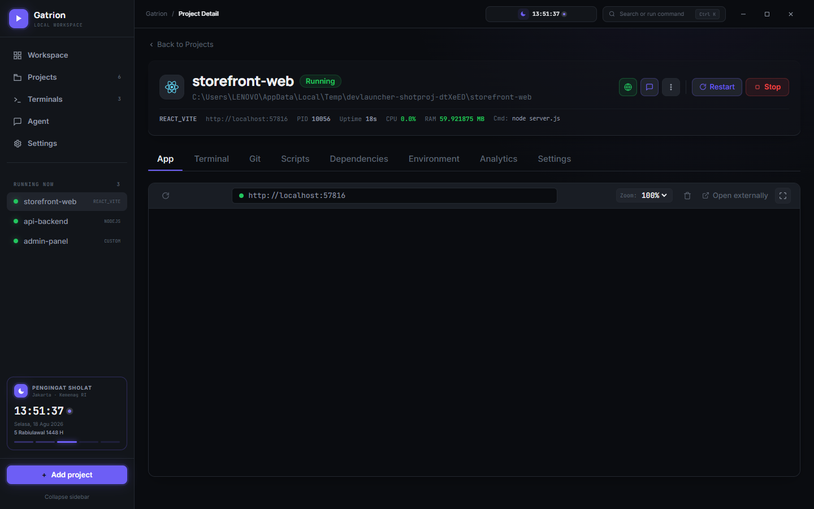
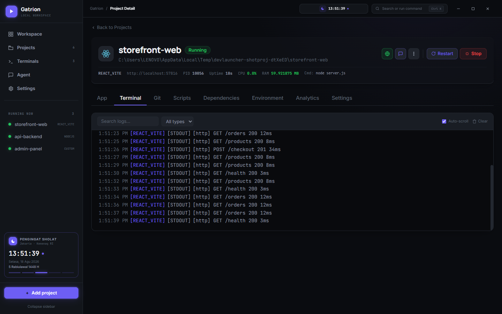
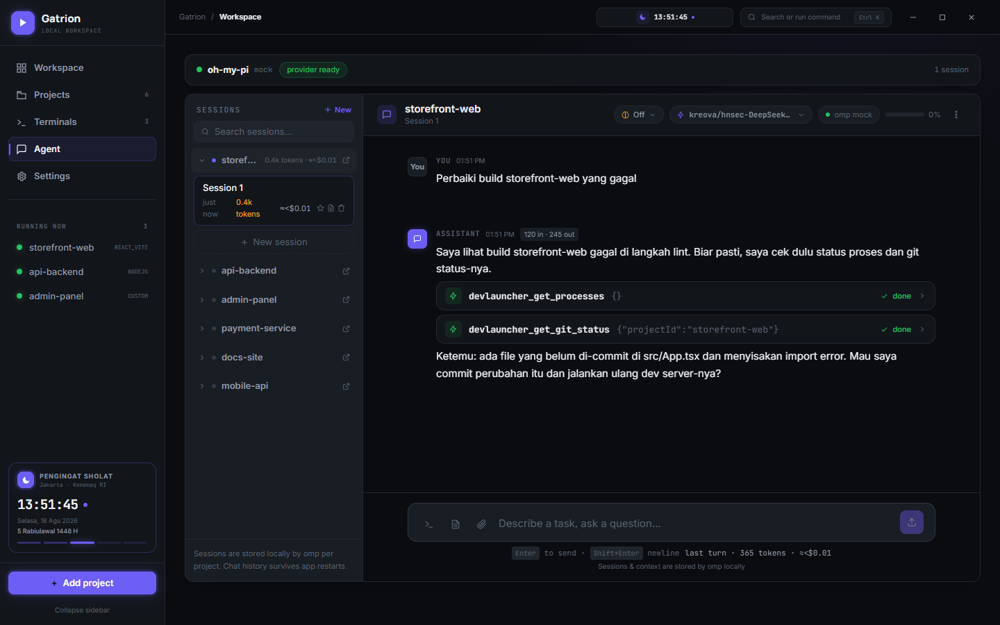

# DevLauncher

> **English** | [Bahasa Indonesia](README.id.md)

**Command center for local dev projects.**

DevLauncher is a free, open-source Windows app that starts, monitors, previews, and chats with every local project from a single window — Laravel, Next.js, Vite, Vue, Go, Node.js, or any custom command.



## Why Gatrion?

Because your dev workflow shouldn't look like chaos theory.

Every day you juggle the same dance: open five terminals, run `npm run dev` in each, remember which port belongs to which service, alt-tab between the browser and the editor, and pray the crash logs are still in scrollback when something dies. DevLauncher removes the juggling — one window for the whole workspace, plus an AI agent that can actually do things, not just talk.

- **One window, everything.** Start, stop, monitor, and see every project — status, CPU, RAM, port, and PID at a glance. No more hunting through task managers.
- **An agent that can act.** Chat with an omp-powered agent per project. It reads your code and, with your permission, controls the app itself through a permission-gated MCP layer (44 tools: start/stop projects, git, .env, terminal, backup, update). Destructive actions always wait for your explicit approval.
- **Local-first by architecture.** Projects, configs, and logs live in your user-data folder. No cloud, no telemetry, no upload — your code never leaves your machine.
- **It updates itself.** In-app auto-update with a real progress bar. No "download the new version from a blog post" ritual.

Download the latest release → [GitHub Releases](https://github.com/adi-santoso/gatrion_devlauncher/releases/latest). Free, MIT licensed, no paywall, no account.

## Screenshots

Real screenshots of the app in action — no mockups.

| | |
|---|---|
|  |  |
| **Embedded preview** — the running app rendered right inside the window, with a mini browser bar and fullscreen mode. | **Terminal & logs** — real-time output with search, type filters, and auto-scroll. |
|  | |

**AI agent + MCP control** — the agent reads your code and calls DevLauncher tools (here: `devlauncher_get_processes`, `devlauncher_get_git_status`), always under your permission rules.

## What you get

### Project management
- **Register any folder as a project** — framework auto-detected (Laravel, Next.js, React/Vite, Vue, Go, Node.js, or Custom) with start command and port. Per-project start commands, env vars, and tags.
- **Full CRUD** — edit, duplicate, delete; drag & drop a folder onto the window to auto-fill the form. Export/import projects as portable JSON (import merges, never overwrites).
- **Workspace presets** — save a group of projects as a preset and start/stop the whole stack with one click, with staggered delays and per-project progress.

### Process control
- **Start / stop / restart** individual projects or all at once, with visible status transitions (Starting → Running → Stopping → Stopped) and PID tracking.
- **Auto-restart** crashed projects with exponential backoff; a smart restart waits for the old port to free up first.
- **Dependency ordering** — `dependsOn` is respected by Start All *and* by the single-project Start button (dependencies auto-start first, topologically).
- **Monitoring** — CPU/RAM sampled every 4 seconds with sparklines on the dashboard; crashes detected on non-zero exit.
- **Notifications** — native Windows notifications with action buttons (Restart on crash, Restart & install on update).

### Logs, terminal & preview
- **Live logs** — stdout/stderr stream in real time with search, highlight, and type filters; thousands of lines scroll smoothly via virtualization.
- **Interactive terminal** — a real PTY shell per project inside the app.
- **Embedded preview** — the running app in a native view with persistent per-project sessions, plus fullscreen and DevTools.

### Project detail
- **Git** — status, stage/unstage, commit, log, diff, branch checkout, pull/push, stash, discard, blame.
- **Dependencies** — `npm outdated` table, update one package or all at once with automatic backup.
- **Environment** — view/edit `.env` files with profile switching and masked secrets.
- **Analytics** — crash history, run history with uptime, daily CPU/memory trends.
- **Script runner** — run any `package.json` script with a health check.

### AI agent (oh-my-pi)
- **Streaming chat per project** over omp's RPC — text, thinking, and tool cards in chronological order.
- **Sessions** per project: create, rename, delete, pin, search, export to Markdown, branch from any message, bash commands, drafts.
- **Cost tracking** — token usage and estimated cost per turn and session.
- **Built-in installer** — downloads the omp binary (SHA256-verified, no admin) or picks up an existing install.
- **Agent can control DevLauncher (MCP, opt-in)** — flip the toggle in Settings and the agent gains 44 tools over a local HTTP MCP server (start/stop projects, git, npm, terminal, preview, .env, backup, update…). Read/write/destructive permissions are per-category toggles; destructive actions always ask in a modal. Off by default, localhost-only with a per-launch token. See [docs/MCP_API.md](docs/MCP_API.md) for the full tool catalog.

### Workspace-wide
- **Command palette** (`Ctrl+K`) — jump to projects, agent sessions, files, and commands.
- **Dashboard** — live status, presets, group-by-tag, activity feed, recent logs.
- **Global shortcut** — `Ctrl+Shift+Space` summons the window from anywhere.

### Settings & data
- **Tabbed settings** — General, Terminal, Data & Backup, Diagnostics, AI Agent, Prayer; saved automatically.
- **Theme & language** — dark/light/system + instant EN/ID switch.
- **Backup** — export everything (projects incl. `.env`, config, presets) to one file, optionally AES-256-GCM encrypted; import merges safely.
- **Diagnostics** — crash dumps, main-log tail, environment check for 17 tools.
- **Updates** — check, download, and install in-app.
- **Desktop integration** — minimize to tray, start on boot, auto-start projects on launch.

## Quick Start

Requirements: Windows 10/11, Node.js ≥ 20, plus whatever runtimes your projects need.

```powershell
git clone https://github.com/adi-santoso/gatrion_devlauncher
cd gatrion_devlauncher
nvm use        # reads .nvmrc (Node 23.9.0)
npm install
npm run dev
```

`npm run dev` starts Vite + Electron together; closing Electron stops Vite too. To run the renderer in a plain browser with mock data: `npm run dev:vite`.

**Using the app:** add a project folder → framework is detected → Start → watch the terminal → open the embedded preview → ask the agent for help when something breaks.

## Commands

| Command | Description |
|---|---|
| `npm run dev` | Start Vite + Electron (development) |
| `npm run dev:vite` | Renderer only, in a browser with mock data |
| `npm test` | All Vitest unit + integration tests |
| `npm run test:e2e` | Playwright end-to-end tests (Electron) |
| `npm run lint` / `npm run lint:fix` | ESLint |
| `npm run typecheck` | TypeScript strict typecheck (renderer + main) |
| `npm run build` | Build renderer, then package NSIS + portable |
| `npm run icons` | Regenerate app icons into `build/` |
| `npm run changelog` | Generate CHANGELOG.md from conventional commits |

## Tech Stack

- Electron 43 (electron-vite 5)
- React 19, Vite 7, TypeScript 5.9 — **strict, 100% of app code**
- Tailwind CSS 4, xterm.js, node-pty
- electron-builder 26 (NSIS + portable)

## Documentation

- [Setup & troubleshooting](docs/SETUP.md)
- [MCP API — 44 agent tools](docs/MCP_API.md)
- [Architecture & data model](docs/ARCHITECTURE.md)
- [IPC contract](docs/IPC_API.md)
- [Feature status](docs/FEATURE_STATUS.md)
- [Roadmap & status](docs/ROADMAP.md)
- [Keyboard shortcuts](docs/KEYBOARD_SHORTCUTS.md)
- [Changelog](CHANGELOG.md)

## Where Data Lives

Nothing is stored in the repository. Electron uses `app.getPath('userData')`:

```
<userData>/projects.json
<userData>/config.json
<userData>/presets.json
<userData>/agent-sessions.json
<userData>/crashDumps/            (local minidumps)
<userData>/omp/omp.exe            (managed omp binary)
```

## Important Notes

- Start commands run through your local shell — only add projects and commands you trust.
- Windows x64 is the primary target; macOS and Linux build in CI but aren't validated on real hardware yet.
- The preview uses a native WebContentsView with a sandboxed iframe fallback.
- App icons regenerate with `npm run icons` into `build/` (gitignored — run before packaging).

## License

MIT
